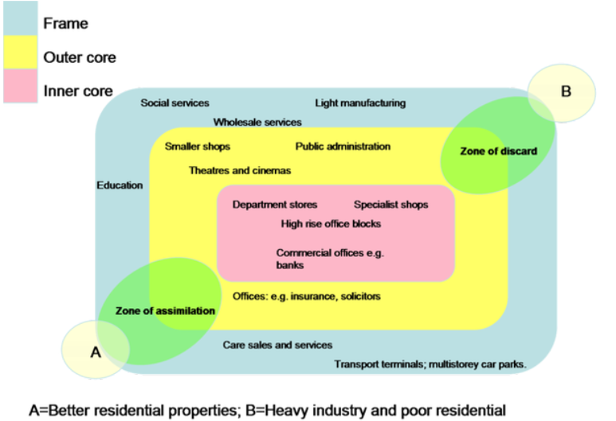

# Brainstorming IA

## Example topics

* Which shops tend to cluster together and which have more regular spacing? 
* Are there different microclimates in different parts of Paris? 
* Question about cultural preservation

## Criteria

* Map 
* Survey 
* Count

## Theme

Overall theme: urban stress

**Economic decline**

## Sampling

The areas need justification & have to be practical

1. Stratified sampling 
You choose the sites, you can cover all aspects. However this can introduce bias into the research. 

2. Random sample
Areas would be randomly chosen on a map. This removes bias but can overlook important areas such as monuments. 

3. Systematic
Areas at regular intervals (e.g. every 50 meters, every 10 minutes). A sort of compromise between stratified and random sampling. 

## Maps

* Border
* Orientation 
* Legend
* Title
* Scale

## Core-frame model 

__Zone of assimilation__: a zone of increasing value; as opposed to a __zone of discard__. 

### High, middle and low outlets

